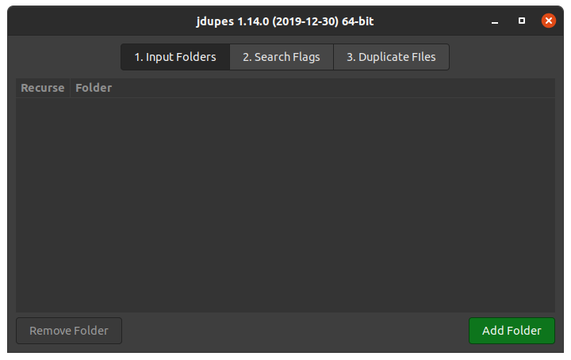

# jdupes-gui
A simple yet complete gtk3 interface for https://github.com/jbruchon/jdupes

## Dependencies
You will need python3 and the pygobject library available from pip.

```sudo pip3 install pygobject``` 

## Running
Make the script executable: ```chmod +x jdupes-gui```

Then run ```./jdupes-gui```

## Known issues
The application is currently fully functional with no known bugs.

A minor inconvenience is caused by the fact that the script is single-threaded. This causes the application to seemingly hang when running long jobs like searching through large folders or deleting large batches of files. Please be patient, it is still working.

# Screenshots
<p align="center">
  
</p>

<p align="center">
  
</p>

<p align="center">
  
</p>

